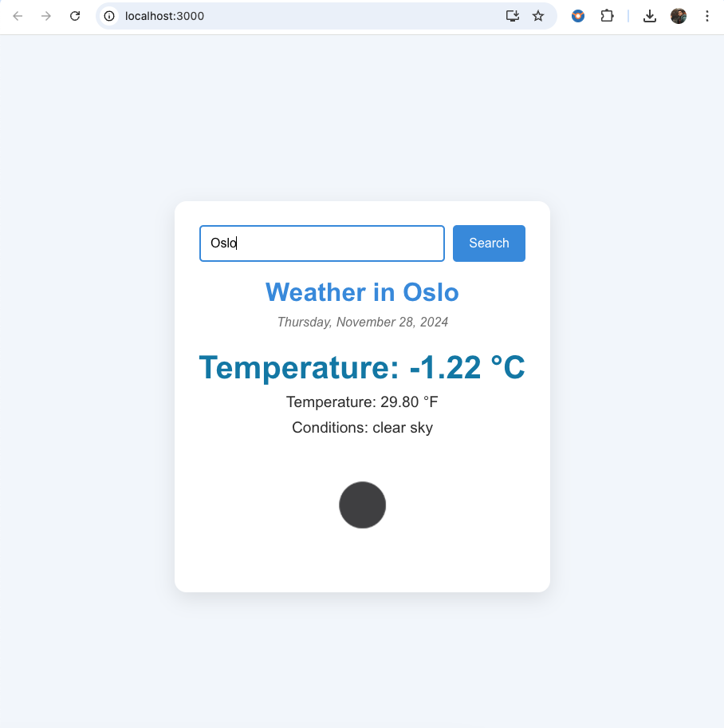

# WeatherApp

## Overview
**WeatherApp** is a React-based app that provides real-time weather updates for cities worldwide using the **OpenWeatherMap API**. Users can search for a city and view temperature, humidity, weather conditions, and more.

## Features
- Real-time weather data (temperature, humidity, etc.)
- Search functionality for any city
- Display of weather icons and conditions

## Prerequisites
- **Node.js** and **npm** installed. (Download from [nodejs.org](https://nodejs.org/))

## Installation

1. Clone the repository:
   ```bash
   git clone [https://github.com/VanshKumar2004/101402651_comp3123_labtest2]

2. Install Dependencies

Navigate into the project folder:
`cd 101402651_comp3123_labtest2`

Install the required npm packages:
```bash
    npm install
    npm install axios
```

3. Set Up the API Key

Create a `.env` file in the root of the project and add the OpenWeatherMap API key:


`REACT_APP_OPENWEATHER_API_KEY=youractualapikey` 

Make sure to replace `youractualapikey` with your actual API key from OpenWeatherMap, which you can get by signing up at [OpenWeatherMap](https://openweathermap.org/).

4. Run the Application

Start the app in development mode:


```bash
npm start
``` 

The app will be available at [http://localhost:3000](http://localhost:3000).

## Deployment

To deploy your app for production, run:

```bash
npm run build
``` 

This will create an optimized version of the app for deployment.

## Screenshots

### Search and Weather Display



### Weather Details for Toronto


## How It Works

-   **User Input**: Users can type a city name in the search bar.
-   **API Request**: When a user submits the search, the app makes a request to the OpenWeatherMap API with the city name and fetches weather data.
-   **Data Rendering**: Once the data is fetched, the app displays the weather details, including temperature (in Celsius and Fahrenheit),weather condition, and an icon representing the current weather condition.

## Contributing

Fork the repo and submit pull requests. Contributions are welcome!